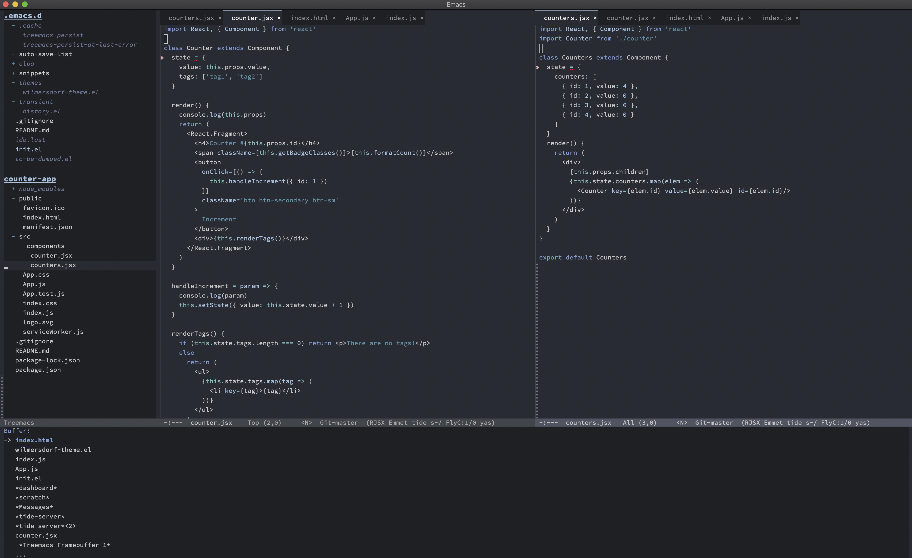

<h3 align="center">😈 Ian's Yay-Evil Emacs: An even better 'better defaults' 😈</h3>
<hr/>

<p align="center">
  
</p>

<p align="center">
<a href="https://github.com/ianpan870102/.emacs.d"></a>
<a href="https://www.gnu.org/licenses/gpl-3.0"></a>
<a href="https://github.com/ianyepan/.emacs.d"></a>
<a href="https://github.com/sindresorhus/awesome"></a>
</p>

### Welcome! 👋
This Emacs "distro" is based on my personal Emacs configuration. It's
unopinionated and was created for general use in mind. The package
settings are grouped in a logical manner, and I've documented as
detailed as possible what each code snippet does in my `config.org`
file.


You can find my opinionated personal configuration
[here](https://github.com/ianyepan/.macOS-emacs.d) (for macOS)
and [here](https://github.com/ianyepan/.wsl-emacs.d) (for Arch and
Ubuntu on WSL2).


This Emacs config starts up **super fast** with an average init time of 0.7 second.



### Installation 🍀
Back up your `~/.emacs.d/` first (if you have one):

```
mv ~/.emacs.d/ ~/.emacs.d.bak/
```

Git clone my configuration to your new `~/.emacs.d/` :

```
git clone https://github.com/ianyepan/yay-evil-emacs.git ~/.emacs.d
```

### "Rolling" Release 🙃
I will constantly push new commits as soon as I discover new things
suitable for this "distro".

### How the config structure works 🧐

The `init.el` requires `config.el`, which is produced by org-babel and
`config.org`. This allows me to put most of my configuration in an Org
file with literate programming style (good for documenting code
usage!).

### Packages that I use:

#### Better package managing syntax and performance
- use-package

#### Vim editing habits (optional depending on your preferences)
- evil
- evil-collection
- evil-commentary

#### Git integration
- magit

#### Better Emacs defaults
- company (auto-completion)
- ido-vertical-mode
- ido-completing-read+ (ido-ubiquitous)
- dashboard (welcome screen)

#### Org mode
- org-bullets

#### Friendly warnings
- flycheck

#### Lightweight syntax highlight improvement for all languages
- highlight-numbers
- highlight-escape-sequences

### Appendix I: Themes I adore

#### Dark themes
- Gruvbox Dark (specifically the [Material](https://github.com/ianyepan/.wsl-emacs.d/blob/master/themes/doom-gruvbox-material-theme.el) variant)
- Visual Studio Code Dark+ [for Emacs](https://github.com/ianyepan/vscode-dark-plus-emacs-theme)

#### Light themes
- [Spacemacs Light](https://github.com/nashamri/spacemacs-theme)

If you prefer a theme pack with some of the most popular themes, I recommend the `doom-themes` package:
- [Doom-themes package](https://github.com/doomemacs/themes)

### Wilmersdorf Theme
The default installation of my Emacs configuration ships with the Wilmersdorf theme I made myself.
It is inspired by Monochrome, Spacemacs Dark, Ariake Dark, and Raiju.
You can find more information on my theme [here](https://github.com/ianyepan/wilmersdorf-emacs-theme).

### Appendix II: Fonts I adore
- Hack / Menlo /DejaVu family (classic, default on lots of systems)
- Source Code Pro (playful and modern-looking, easy on the eyes)
- Consolas (beautifully modern)
- Recursive Mono Semicasual
- Roboto Mono
- Ubuntu Mono

### FAQ: ❓
#### 1. But I'm not an Evil user
Sure! Simply delete (or comment) the sections regarding Vi bindings in
`config.org`.

#### 2. How can I install extra packages that I want?
You should be able to install packages the normal way (`M-x
list-packages RET` and `i x` on the desired package row). If you plan
to sync your config files across machines, add the configuration in
`config.org` with your preferred syntax (use-package is
recommended). Yay-Evil sets all the packages `:ensure` to true by
default, so you don't need to add `:ensure t`.

#### 3. How can I remove packages that I don't need?
For this you need two steps:
- First, in the `config.org` file, remove (or comment out) the
  relevant configuration code.
- Next, type `M-x list-packages RET` and delete the unwanted package
  by placing your cursor on the target row and press `d` followed by an `x`.
